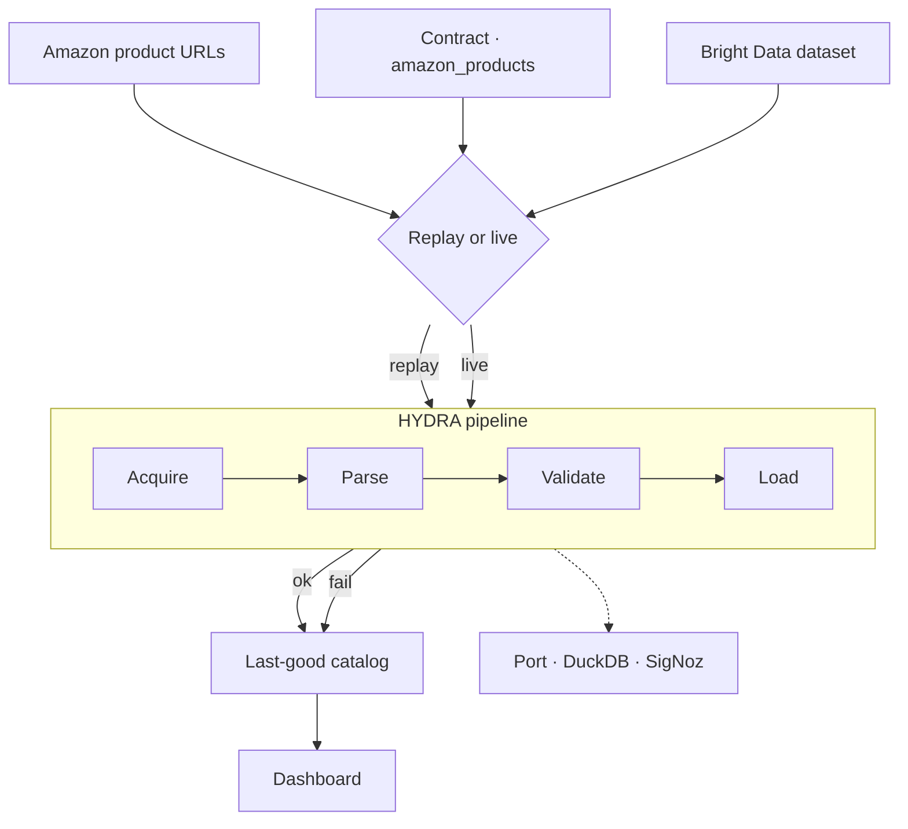
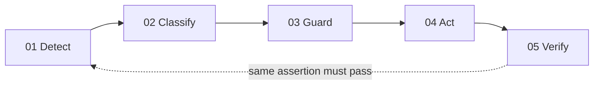
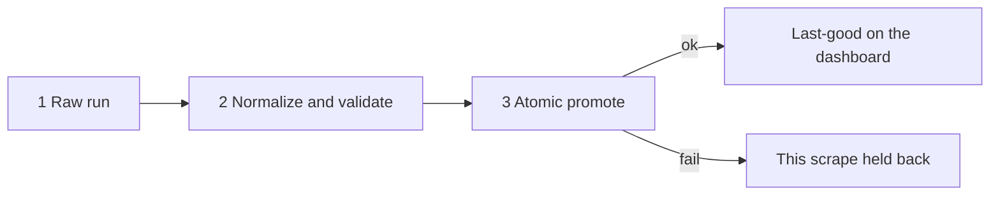

# HYDRA

A self-healing Amazon catalog dashboard. When a scrape fails, the last-good catalog stays on screen. HYDRA detects the failure, classifies it, guards the repair, acts, and verifies.

[Sruthi Anuvalasetty](https://www.linkedin.com/in/sruthi-anuvalasetty/) · [Ramachandra Nalam](https://www.linkedin.com/in/ramachandra-nalam/)

---

## Dashboard

This is the public dashboard we built: Amazon product cards, a health ribbon, and a Break control that walks Detect → Classify → Guard → Act → Verify.

**https://zero-downtime-hackathon-dusky.vercel.app**

It deploys from GitHub `main` on Vercel. A local copy can run on `http://127.0.0.1:8080`.

Pick a fault, click **Break Amazon**, and watch the catalog and the five stages. Dark / Light stays at the bottom left. Default mode is **replay** (`HYDRA_MODE=replay`) — no Bright Data key required.

---

## What we built

HYDRA is a self-healing data agent pointed at one source: **Amazon products**.

| | |
|---|---|
| Source | `amazon_products` |
| Contract | `contracts/amazon_products.json` |
| Replay fixture | `fixtures/amazon_products.json` |
| Bright Data dataset | `gd_l7q7dkf244hwjntr0` |
| Collection | `hl_bbd9eb9a` |
| Serving snapshot | `data/hydra-live.json` |
| Required fields | `asin`, `title` |
| Quality floor | at least 5 products |

The dashboard shows real Amazon rows (ASIN, title, price, availability). Replay serves the fixture so the page does not call Bright Data on every tick.

---

## Architecture

Raw scrape output never lands on the catalog the dashboard serves. Acquire, parse, validate, then promote. If a scrape fails, the last-good catalog stays up.



### Closed-loop heal

A repair counts only if the same check that failed, passes afterward.



| Step | What the dashboard shows |
|---|---|
| **Detect** | A failed Amazon scrape opens an incident (MTTD). |
| **Classify** | Telemetry maps to a failure class, F1–F6. |
| **Guard** | Heal budget, circuit, and autonomy tier. Schema changes wait for approve. |
| **Act** | One primitive from P1–P8 (backoff, climb the ladder, quarantine, replay raw, stop). |
| **Verify** | Re-run the failing assertion. |

### Last-good catalog

The dashboard reads `data/hydra-live.json`. It keeps `products_good` when `products_now` is bad. Raw runs stay in `data/raw/`.



---

## Eight Amazon faults

The Break dropdown injects one runtime fault. Same agent, same eight primitives.

| Fault | What you see | Class | Typical repair |
|---|---|---|---|
| **Loud · HTTP 403** | Scrape blocked | F1 | P6 backoff, then P1 climb the ladder |
| **Loud · captcha wall** | Not a product feed | F1 | P1 escalate acquisition |
| **Quiet · volume collapse** | Too few products | F2 / F4 | P5 replay raw, then P1 |
| **Quiet · selector drift** | 0 products extracted | F2 | P5 then P1 |
| **Schema · price renamed** | Price field gone | F4 | Tier 2 — Guard asks before changing shape |
| **Schema · prices become n/a** | Type errors | F3 | P4 quarantine bad values |
| **Quality · null flood** | Most prices empty | F4 | P5 replay from raw |
| **Poison · one bad row** | One product corrupts the batch | F3 / F6 | P4 drop the poison row |

**Heal success** on the scoreboard is **incidents healed / incidents finished**, not every ladder step. Backoff (P6) then a verified P1 is **one** healed incident.

---

## Using the dashboard

1. Open the [dashboard](https://zero-downtime-hackathon-dusky.vercel.app). The catalog starts healthy.
2. Choose a fault and click **Break Amazon**. The ribbon marks the break. Cards keep last-good (or show the damaged fields for that fault). Stages walk Detect → Verify.
3. Wait for **Healthy** before the next break.
4. The scoreboard tracks MTTD, MTTA, MTTR, heal success, false-heal rate, and autonomy.

---

## Run it locally

Python 3.11+ and a virtualenv.

```bash
python3 -m venv .venv
.venv/bin/python -m pip install -r requirements-hydra.txt
cp .env.example .env
make hydra-test
make hydra-dashboard
```

Then open `http://127.0.0.1:8080`.

```bash
# one scrape from the fixture
.venv/bin/python -m hydra scrape --source amazon_products

# same loop as the Break button
.venv/bin/python -m hydra break --source amazon_products --fault http_403
.venv/bin/python -m hydra heal --source amazon_products
.venv/bin/python -m hydra status
```

### Live Bright Data (optional)

Needs `BRIGHTDATA_API_TOKEN` or `BRIGHTDATA_API_KEY`. Replay stays on `:8080`. Live is isolated on `:8081` so it cannot overwrite the replay snapshot.

```bash
export BRIGHTDATA_API_TOKEN=...
make hydra-amazon              # one live ingest
make hydra-dashboard-live      # http://0.0.0.0:8081
```

---

## Commands

```
make hydra-test
make hydra-dashboard           # replay UI on :8080
make hydra-dashboard-live      # live UI on :8081
make hydra-amazon              # live scrape, needs a key
make hydra-port-amazon         # optional Port ledger sync
make hydra-signoz              # optional SigNoz

python3 -m hydra scrape|break|heal|status|approve|reset-circuit|dashboard
```

Env for the dashboard (see `.env.example`):

```
HYDRA_MODE=replay
HYDRA_DASHBOARD_BIND=0.0.0.0
HYDRA_DASHBOARD_PORT=8080
HYDRA_DASHBOARD_CONTROLS=1
HYDRA_DASHBOARD_INTERVAL_S=3
HYDRA_DASHBOARD_HOLD_S=3.5
```

---

## Invariants

1. **Last-good stays up.** Raw Bright Data / CLI output is never written onto the serving catalog.
2. **Heal is triggered.** The dashboard heals after you break. There is no silent auto-heal on a healthy feed.
3. **One Amazon contract.** `amazon_products` — do not create a second scraper for this dashboard.
4. **Port writes hit the local ledger first.** A Port login failure does not fail the pipeline.
5. **OTEL failures are swallowed** (3s timeout, log once). The dashboard does not require SigNoz.

---

## Repository map

```
contracts/amazon_products.json   contract + assertions + ladder
fixtures/amazon_products.json    replay catalog
hydra/dashboard.py               dashboard UI
hydra/dashboard_live.py          isolated live UI (:8081)
hydra/runtime/                   acquire → parse → validate → load
hydra/agent/                     detect, classify, guard, act, verify
hydra/chaos/                     the eight Amazon faults
data/hydra-live.json             serving snapshot (gitignored)
```

Design notes for the agent live in `HYDRA.md`.
