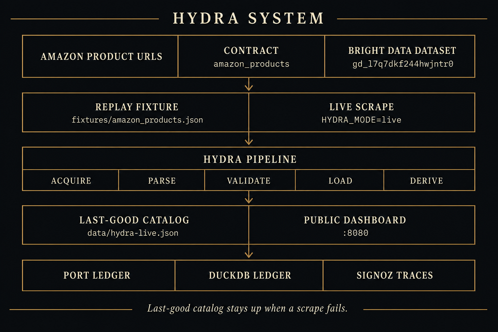
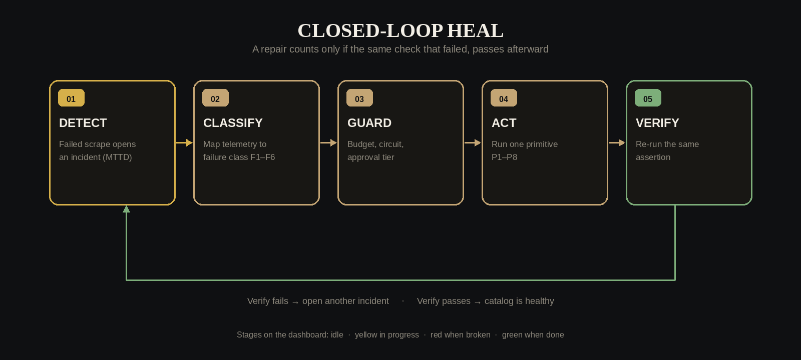
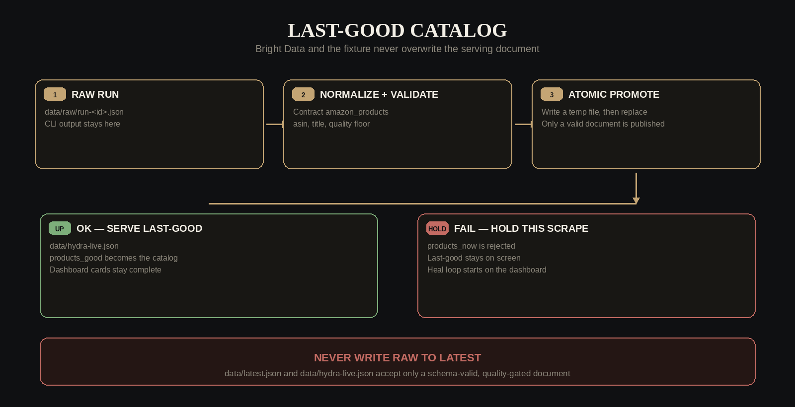
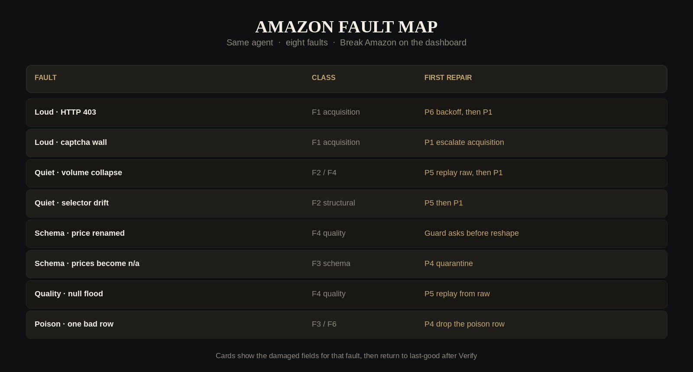

# HYDRA

**Amazon catalog reliability.** When the scrape breaks, the last-good catalog stays up. HYDRA detects the failure, classifies it, guards the repair, acts, and verifies — without a human in the loop for most classes.

[Sruthi Anuvalasetty](https://www.linkedin.com/in/sruthi-anuvalasetty/) · [Ramachandra Nalam](https://www.linkedin.com/in/ramachandra-nalam/)

---

## Dashboard

**Judges, open this:**

# [https://zero-downtime-hackathon-dusky.vercel.app](https://zero-downtime-hackathon-dusky.vercel.app)

Live on Vercel from GitHub `main`. Server copy: [http://2.29.4.204:8080](http://2.29.4.204:8080). Copy-paste URL: [`DASHBOARD.md`](DASHBOARD.md).

No Port login. No SigNoz login. Choose a fault, click **Break Amazon**, watch Detect → Classify → Guard → Act → Verify. Dark / Light stays pinned at the bottom left.

Default mode is **replay** (`HYDRA_MODE=replay`). You do not need a Bright Data key for the demo.

---

## What it is

HYDRA is a self-healing data agent pointed at one source: **Amazon products**.

| | |
|---|---|
| Source | `amazon_products` |
| Contract | `contracts/amazon_products.json` |
| Replay fixture | `fixtures/amazon_products.json` |
| Bright Data dataset | `gd_l7q7dkf244hwjntr0` |
| Collection | `hl_bbd9eb9a` |
| Serving snapshot | `data/hydra-live.json` |
| Required fields | `asin`, `title` |
| Quality floor | at least 5 products |

The catalog on the dashboard is real Amazon rows (ASIN, title, price, availability). Replay means we are not calling Bright Data on every tick, so the demo does not depend on venue wifi.

---

## Architecture

HYDRA never writes a raw scrape onto the catalog the public page serves. Acquire, parse, validate, then promote. If the scrape fails, cards stay on last-good.



### Closed-loop heal

A repair is only a repair if the same check that failed, passes afterward.



| Step | What judges see |
|---|---|
| **Detect** | Failed Amazon scrape opens an incident (MTTD). |
| **Classify** | Telemetry maps to a failure class, F1–F6. No Amazon-specific if-statements. |
| **Guard** | Heal budget, circuit, and autonomy tier. Schema changes wait for approve. |
| **Act** | One primitive from P1–P8 (backoff, climb the ladder, quarantine, replay raw, stop). |
| **Verify** | Re-run the failing assertion. No softer substitute check. |

### Last-good catalog

Bright Data (or the fixture) never overwrites the serving document. Raw goes to `data/raw/`. The dashboard reads `data/hydra-live.json` and keeps `products_good` when `products_now` is bad.



---

## Eight Amazon faults

Every fault is a runtime flag. The Break dropdown on the dashboard injects one. Same agent, same eight primitives.



| Fault | What you see | Class | Typical repair |
|---|---|---|---|
| **Loud · HTTP 403** | Scrape blocked | F1 | P6 backoff, then P1 climb the ladder |
| **Loud · captcha wall** | Not a product feed | F1 | P1 escalate acquisition |
| **Quiet · volume collapse** | Too few products | F2 / F4 | P5 replay raw, then P1 |
| **Quiet · selector drift** | 0 products extracted | F2 | P5 then P1 |
| **Schema · price renamed** | Price field gone | F4 | Tier 2 — Guard asks before changing shape |
| **Schema · prices become n/a** | Type errors | F3 | P4 quarantine bad values |
| **Quality · null flood** | Most prices empty | F4 | P5 replay from raw |
| **Poison · one bad row** | One product corrupts the batch | F3 / F6 | P4 drop the poison row |

**Heal success** on the scoreboard is **incidents healed / incidents finished**, not every ladder step. Backoff (P6) then a verified P1 is **one** healed incident.

---

## Run it

Python 3.11+ and a virtualenv.

```bash
python3 -m venv .venv
.venv/bin/python -m pip install -r requirements-hydra.txt
cp .env.example .env
make hydra-test
make hydra-dashboard
```

Then open `http://127.0.0.1:8080` (this machine: `http://2.29.4.204:8080`).

```bash
# one scrape from the fixture
.venv/bin/python -m hydra scrape --source amazon_products

# same loop as the Break button
.venv/bin/python -m hydra break --source amazon_products --fault http_403
.venv/bin/python -m hydra heal --source amazon_products
.venv/bin/python -m hydra status
```

### Live Bright Data (optional)

Only if a judge asks to see a live fetch. Needs `BRIGHTDATA_API_TOKEN` or `BRIGHTDATA_API_KEY`. Replay stays on `:8080`. Live is isolated on `:8081` so it cannot overwrite the replay snapshot.

```bash
export BRIGHTDATA_API_TOKEN=...
make hydra-amazon              # one live ingest
make hydra-dashboard-live      # http://0.0.0.0:8081
```

---

## Commands

```
make hydra-test
make hydra-dashboard           # replay UI on :8080
make hydra-dashboard-live      # live UI on :8081
make hydra-amazon              # live scrape, needs a key
make hydra-port-amazon         # optional Port ledger sync
make hydra-signoz              # optional SigNoz

python3 -m hydra scrape|break|heal|status|approve|reset-circuit|dashboard
```

Env that matters for the public page (see `.env.example`):

```
HYDRA_MODE=replay
HYDRA_DASHBOARD_BIND=0.0.0.0
HYDRA_DASHBOARD_PORT=8080
HYDRA_DASHBOARD_CONTROLS=1
HYDRA_DASHBOARD_INTERVAL_S=3
HYDRA_DASHBOARD_HOLD_S=3.5
```

---

## Invariants

1. **Last-good stays up.** Raw Bright Data / CLI output is never written onto the serving catalog.
2. **Heal is triggered.** The dashboard watch loop heals after you break. There is no silent auto-heal on a healthy feed.
3. **One Amazon contract.** `amazon_products` — do not create a second scraper for the demo.
4. **Port writes hit the local ledger first.** A Port login failure does not fail the pipeline.
5. **OTEL failures are swallowed** (3s timeout, log once). Service name for HYDRA paths stays with the HYDRA runtime; the dashboard does not require SigNoz.

---

## Judge script (about four minutes)

1. Open [http://2.29.4.204:8080](http://2.29.4.204:8080). Names under the title are LinkedIn links. Catalog is healthy.
2. **Loud 403.** Break Amazon. Ribbon says BROKE. Catalog holds last-good. Loop walks Detect → Verify. Pill returns to Healthy.
3. **Quiet volume collapse.** HTTP 200, too few rows. This is the failure that usually ships bad data. HYDRA catches the floor assertion.
4. **Schema rename** if you want Guard. Tier 2 stops and asks.
5. Read the scoreboard: MTTD, MTTA, MTTR, heal success, false-heal rate, autonomy. Hover any tile.

One break at a time. Wait for **Healthy** before the next.

---

## Repository map

```
contracts/amazon_products.json   contract + assertions + ladder
fixtures/amazon_products.json    replay catalog
hydra/dashboard.py               public UI (:8080)
hydra/dashboard_live.py          isolated live UI (:8081)
hydra/runtime/                   acquire → parse → validate → load
hydra/agent/                     detect, classify, guard, act, verify
hydra/chaos/                     the eight Amazon faults
data/hydra-live.json             serving snapshot (gitignored)
```

Design notes for the agent itself live in `HYDRA.md`. This README is the Amazon catalog product.
