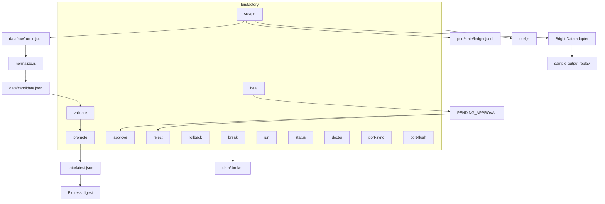
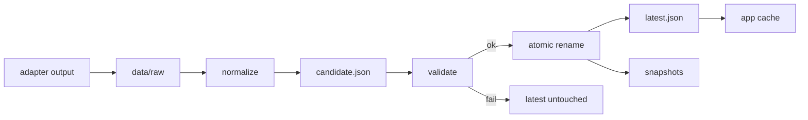
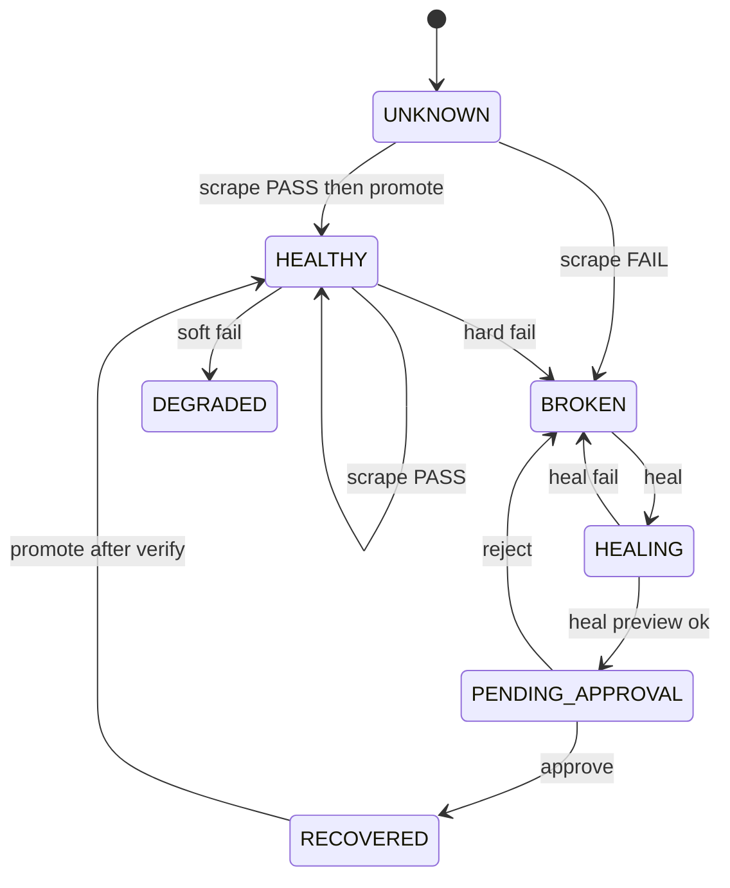
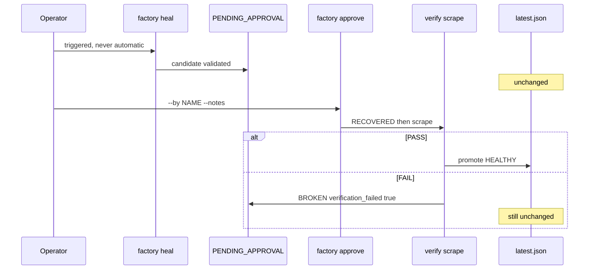
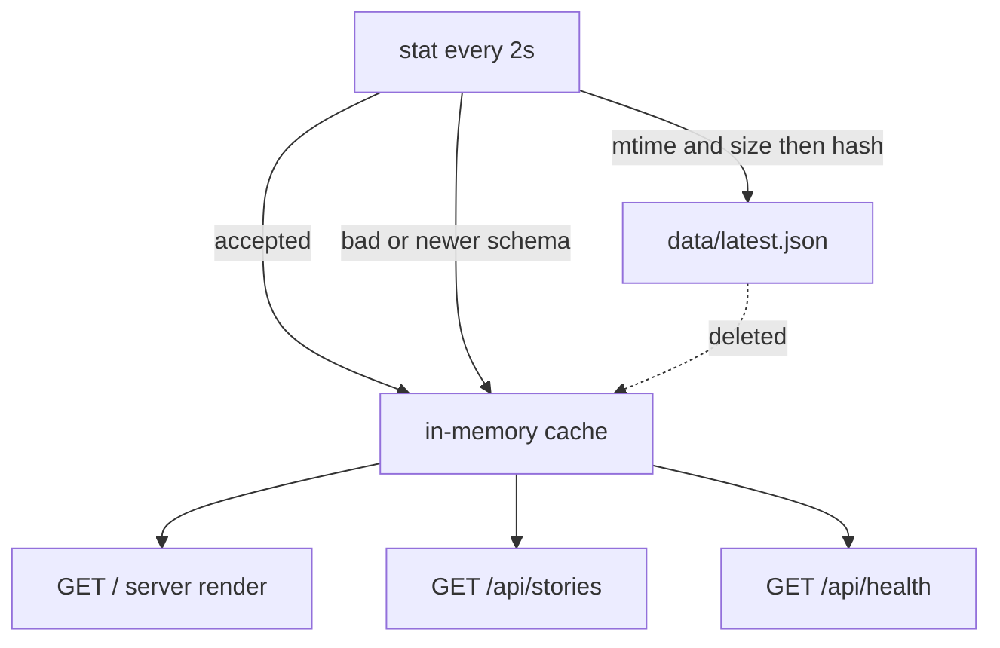
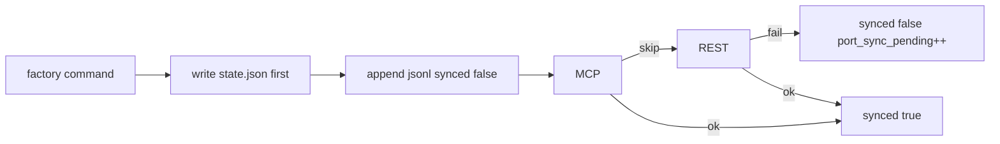
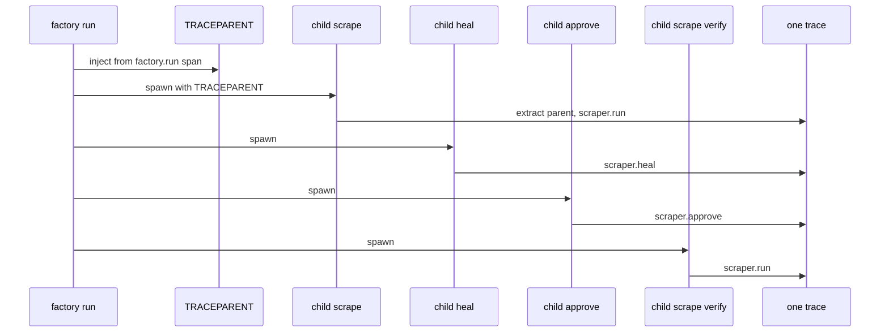

# Remaining spec: judge-track closeout

**Status:** uncommitted. Describes work that is **not** in `b76e8fc`.
**Baseline:** commit `b76e8fc` (`Replace the Python scaffold with a replayable Node factory.`).
**Source of truth for IDs:** the original Zero Downtime Factory spec (INV-1, REQ-*, EC-*, TEST-*, DEC-*).
**In-repo v0 contract:** `SPEC.md` / `plan.md` in that commit describe what already shipped. Do not treat them as the remaining work.

This file is the implementable spec for everything still missing. It also maps the committed tree so the remaining work has a place to land. Do not start a second factory.

INV-1 still governs every write: `data/latest.json` is absent or a valid, quality-gated envelope. A failed scrape, a kill mid-promote, or a rejected heal never mutates it.

---

## 1. What already shipped (`b76e8fc`)

A Node 20 ESM factory. Replay is the default. The digest app stays on HTTP 200 when a scrape fails. TRACEPARENT extract/inject and `shutdown()` in `runFactory`'s `finally` are in the tree.



### 1.1 Layout (committed)

```
bin/factory
src/cli.js
src/config.js  logger.js  lock.js  atomic.js  state.js  ids.js
src/adapters/brightdata/{index,commands,exec,classify}.js
src/adapters/port/{index,mcp,rest,ledger}.js
src/pipeline/{normalize,validate,promote,run}.js
src/telemetry/{otel,context,metrics}.js
src/commands/{scrape,validate,heal,approve,reject,promote,rollback,status,break,run,port-sync,port-flush,doctor}.js
app/{server,store,instrumentation}.js  public/{index.html,styles.css}
data/sample-output/{healthy,broken,healed,heal-preview}.json
tests/{unit,integration,chaos,app,demo,fixtures}
port/blueprints/{service,scraper,factory_run,approval}.json
scripts/{setup,probe,scrape,heal,factory-run,demo,reset}.sh
```

Runtime files are gitignored: `data/latest.json`, `candidate.json`, `state.json`, `raw/*`, `snapshots/*`, `port/state/*.jsonl`, `.broken`, `.healed`.

### 1.2 Data path that already protects INV-1



Scrape writes `candidate.json` only. Promote is the only writer of `latest.json`. That part stays.

### 1.3 State machine that already exists

Seven statuses: `UNKNOWN`, `HEALTHY`, `DEGRADED`, `BROKEN`, `HEALING`, `PENDING_APPROVAL`, `RECOVERED`.



What v0 got wrong about this machine is listed in section 3. The names of the seven states stay.

### 1.4 TRACEPARENT that already exists

`extractParentContextFromEnv()` and `injectTraceparentIntoEnv()` use `@opentelemetry/api` `propagation.extract` / `inject`. `withSpan` parents on the extracted context. `runFactory` awaits `shutdown()` in `finally`.

`factory run` still calls scrape and promote **in-process**. `scripts/demo.sh` still launches four separate `bin/factory` processes. That is why the heal loop is not yet one SigNoz trace. See R8.

---

## 2. What this remaining spec is for

Close the gap between `b76e8fc` and the original judge-track spec. Change the files above. Do not add a second CLI, a database, or a Python app.

```mermaid
flowchart LR
  shipped[b76e8fc replay factory] --> contracts[R1 G1-G11 envelope]
  contracts --> primitives[R2 atomic lock logger exits]
  primitives --> state[R3 state.json shape]
  state --> commands[R4 heal verify break modes]
  commands --> bd[R5 adapter leftovers]
  bd --> app[R6 digest contract]
  app --> port[R7 Port blueprints]
  port --> otel[R8 spawn TRACEPARENT]
  otel --> demo[R9 original TEST-IDs]
```



DEC-01 through DEC-08 stay. Node, adapter-wrapped Bright Data CLI, live/record/replay, never write raw to `latest.json`, Port never fails the pipeline, OTEL failures swallowed, heal is triggered, one service name `zero-downtime-factory`.

---

## 3. Contract mismatches to invert

These are the reasons the remaining work exists. Each row is a required change.

### 3.1 Envelope and gates

v0 `validate(doc)` uses a different G1–G11 (schema_version, generated_at, source, stories array, title, url, numeric points, duplicate urls, collector/run id). Verdict is `{ ok, errors }`.

Required:

```
validate(envelope, lastKnownGoodSummary, config) =>
  { verdict, gates, nullRates, warnings, failures }
```

| Gate | Type | Rule | On breach |
|:--|:--|:--|:--|
| G1 parse | hard | valid JSON | FAIL |
| G2 shape | hard | normalises to a non-null array | FAIL |
| G3 volume | hard | `item_count >= MIN_ITEMS` (20) | FAIL |
| G4 required | hard | title and url null rate is 0 | FAIL |
| G5 numeric-null | hard | over **non-job** rows, points null rate `<= MAX_NULL_RATE` (0.10) | FAIL |
| G6 types | hard | points, comment_count, rank are integers `>= 0` or null | FAIL |
| G7 unique | soft | id collisions after dedupe | WARN |
| G8 drift | soft | unknown fields, or an optional expected field entirely absent | WARN |
| G9 sanity | hard | item_count in `[0.5x, 2.0x]` of last-known-good, when LKG exists | FAIL |
| G10 job-ratio | soft | `is_job` rows `> MAX_JOB_ROWS` (3) | WARN |
| G11 freshness | soft | `generated_at` older than `STALE_AFTER_SECONDS` (900) | WARN |

Any hard breach → `FAIL`. Else any soft breach → `WARN`. Else `PASS`.
`PASS` promotes to `HEALTHY`. `WARN` promotes to `DEGRADED`. `FAIL` does not promote.

`latest.json` envelope:

```json
{
  "schema_version": 1,
  "generated_at": "2026-08-21T18:04:11.204Z",
  "run_id": "run_01J...",
  "collector_id": "c_xxx",
  "source_url": "https://news.ycombinator.com",
  "item_count": 30,
  "quality": {
    "verdict": "PASS",
    "gates": { "G1": "pass" },
    "null_rates": { "points": 0.0, "author": 0.0, "comment_count": 0.0 },
    "warnings": []
  },
  "provenance": { "heal_id": null, "approval_id": null, "healed_at": null },
  "stories": []
}
```

Story fields: `id`, `rank`, `title`, `url`, `domain` (not `site`), `points`, `author`, `comment_count`, `is_job`, `scraped_at`.

### 3.2 Normalize (N-01 to N-11)

v0 `asNumber(..., 0)` turns missing points into 0. Jobs are guessed with a regex. No `"discuss"` → 0. No HTML-entity decode. No relative `item?id=` resolve. No NDJSON. No `results` unwrap.

Required:

- N-01: accept `Story[]`, `{ data }`, `{ results }`, `{ items }`, NDJSON. Else `FAIL_SHAPE`.
- N-02: alias `comment_count|comments|commentCount|num_comments`, `points|score|upvotes`, `author|by|user`, `url|link|href`, `title|headline|text`. Log which alias hit.
- N-03: points strip non-digits. Empty or absent → `null`. Never coerce to 0.
- N-04: `"89 comments"` → 89. `"discuss"` or `"comment"` → 0. Absent → `null`.
- N-05: resolve relative URLs against `https://news.ycombinator.com/`. Drop `javascript:`, `data:`, `file:`.
- N-06: id from `item?id=(\d+)`, else `sha1(title + '|' + url).slice(0,16)`.
- N-07: HTML-entity decode, trim, collapse whitespace, NFC.
- N-08: keep emoji, CJK, RTL. Truncate at a code-point boundary.
- N-09: `is_job = (author == null && points == null && comment_count == null)`.
- N-10: title cap 512, url cap 2048. Truncate + warning, not FAIL.
- N-11: `scraped_at` set once per run from process clock UTC.

Clock skew: if `generated_at > now + 60s`, clamp to now and warn (EC-DATA-13).

### 3.3 State document (REQ-SM-01)

v0 uses `status`, `last_run_id`, a nested `approval`, no history. Rollback can land `HEALTHY` via `recordSuccess`. `scrape.js` calls `saveState` and bypasses `transition`.

Required shape:

```json
{
  "schema_version": 1,
  "collector_id": "c_xxx",
  "state": "HEALTHY",
  "updated_at": "2026-08-21T18:04:11.204Z",
  "last_run": { "run_id": "run_01J...", "verdict": "PASS", "at": "...", "item_count": 30 },
  "last_promote_at": "...",
  "last_heal": { "heal_id": "heal_01J...", "at": "...", "prompt": "...", "status": "approved" },
  "last_approval": { "approval_id": "apr_01J...", "decision": "approve", "decided_by": "ramachandra", "at": "...", "notes": "..." },
  "consecutive_failures": 0,
  "port_sync_pending": 0,
  "history": []
}
```

`history` is a ring of 50 `{ from, to, at, run_id }`. Read v0 `status` once if present, then rewrite as `state`. All writes go through `transition` or reconstruct. Illegal transition: exit 3, name current state and legal next actions, no disk write. Reconstruct from `latest.json` → `HEALTHY` with unknown provenance, log, emit `state.reconstructed`. Circuit at `consecutive_failures >= 3` prints `factory heal` / `factory doctor`. `--force` overrides. Rollback from any state → `DEGRADED`.

Approve path:



### 3.4 Exit codes (Appendix A)

v0 maps 4=VALIDATION, 5=SCRAPE, 6=LOCK, 7=CIRCUIT, 8=NOT_APPROVED, 10=PARSE. Demo step 5 requires scrape FAIL → **exit 10**.

| Code | Meaning |
|:--|:--|
| 0 | Success |
| 1 | Generic |
| 2 | Config (missing Collector ID, bad env) |
| 3 | Illegal state transition |
| 4 | Lock held by another process |
| 5 | Filesystem (`ENOSPC`, `EACCES`) |
| 6 | Bright Data auth |
| 7 | App port in use |
| 8 | Bright Data rate limit / quota |
| 9 | Bright Data network or timeout |
| 10 | Validation FAIL |
| 11 | Validation WARN |
| 12 | Port sync deferred |

### 3.5 Atomic write and lock

v0 writes `.<basename>.<pid>.<hex>.tmp`, fsyncs the file, renames, does not fsync the directory. Lock breaks stale by dead pid only. Lock exit is 6.

Required: `latest.json.tmp.<pid>` in the same directory, fsync file, close, rename, fsync directory. Windows: retry rename 5 × 50ms; persistent `EPERM`/`EACCES` → unlink + rename + warn. `ENOSPC`: delete tmp, leave target, exit 5. Lock payload `{ pid, startedAt, command }`. Stale if pid dead **or** older than `LOCK_TTL_SECONDS` (600). Second process exit 4. Keep `O_EXCL`. Do not switch to `flock`.

### 3.6 CLI surface

Missing: `factory scraper:create`, `factory port:bootstrap`, colon aliases `port:sync` / `port:flush`. `--dry-run` is parsed but ignored by validate, status, doctor, run. No `--by` / `--notes`. No `validate --file`. No `rollback --to`.

`factory break` writes `data/.broken`. Required: `data/.break` with `--mode null-fields|empty|schema-drift|garbage|http-error|timeout` and `--clear`. `factory status` prints a loud banner when a break is armed.

Collector ID precedence: `--collector-id` → `SCRAPER_STUDIO_COLLECTOR_ID` → `CLAUDE.md` → `agent-rules/scraper.md`. Empty or `c_REPLACE_ME` exits 2 before spawn. Mismatch across sources warns. Walk up to root `package.json` with `"name": "zero-downtime-factory"`. `validate` must not require Bright Data credentials.

### 3.7 App

v0 reads the file on every `load()`, invalidates on `mtimeMs` only, no hash poll, no `Cache-Control`, no `EADDRINUSE` → 7, no error middleware. `/api/stories` omits `{ degraded, reason }`.

Required:

- Cold start: `/` 200 empty state. `/api/stories` `{ stories: [], degraded: true, reason: "no_data" }` 200.
- Poll `stat` every 2000ms. Compare `mtimeMs` **and** `size`, then hash. Debounce 250ms.
- Unknown `schema_version`: refuse file, keep cache, health `schema_version`.
- Invalid JSON: log once per file hash, keep cache, `parse_error`.
- Deleted file: keep cache, `file_missing`.
- Stale: serve + badge, `stale`.
- `Cache-Control: no-store` on `/api/*`.
- Provenance from envelope only (`provenance.healed_at`).
- XSS: keep `escapeHtml`. Never `innerHTML`.
- `EADDRINUSE`: print port, exit 7, do not pick another port.
- Error middleware `{ error: "internal" }`. `unhandledRejection` / `uncaughtException` log and stay up unless `EADDRINUSE`.



### 3.8 Port

v0 `factory_run` blueprint has `collector_id`, `status`, `story_count`. One `ledger.jsonl`. `upsertEntity(root, type, id, props)`.

Required interface:

```js
upsertEntity({ blueprint, identifier, title, properties, relations })
  -> { ok, mode, deferred }
```

Blueprints:

| Blueprint | Identifier | Must have |
|:--|:--|:--|
| service | `hn-digest` | name, repo_url, status, owner, live_url, relation scraper |
| scraper | `hn-top-stories` | collector_id, target_url, schema_fields, state, last_heal, last_run, consecutive_failures |
| factory_run | `<run_id>` | brief, status, verdict, started_at, finished_at, agent, item_count, **trace_id**, artifacts |
| approval | `<run_id>-<type>` | type, status, decided_by, decided_at, notes, verification_passed, relation run |

Ledger: `port/state/<blueprint>.jsonl`, append `synced: false` **before** MCP/REST, patch `synced: true` on success. Local state write always precedes Port. Unknown properties dropped with a warning. `factory port:bootstrap` idempotent. `port:flush` twice is a no-op.



### 3.9 Telemetry still missing

Keep extract/inject and `finally { await shutdown() }`. Do not rewrite `context.js`.

Still required:

- `factory run` **spawns** `bin/factory scrape|heal|approve` with injected `TRACEPARENT`. Capture child stdout when `--json` is set.
- Unset endpoint → `ConsoleSpanExporter` + one-line notice (v0 noops; demo sets `FACTORY_OTEL_DISABLED=1`).
- `shutdown()` = `forceFlush` then `sdk.shutdown()`, raced at 4s.
- `FACTORY_OTEL_SIMPLE=1` → `SimpleSpanProcessor`. CLI `scheduledDelayMillis: 500`.
- Span names from original section 9.3 (`scraper.run`, not `factory.scrape`).
- Events: `scraper.break_detected`, `scraper.healed`, `data.promoted`, `data.rejected`, `data.rollback`, `state.transition` with `from`/`to`.
- Failures: `recordException` **and** `span.setStatus(ERROR)`.
- Attributes primitives, capped 512.
- Metrics 9.4 as OTEL instruments, including `data.age.seconds` and `validate.null_rate`.
- Disable `fs` instrumentation. Do not trace `/api/health` or static assets.
- Dashboard: six panels in narrate order (availability, freshness, throughput, latency, errors/heals, heal-trace). v0 has three widgets.



### 3.10 Logger, ids, fixtures, tests

Logger has no redaction. Redact known secret env names and `/[A-Za-z0-9_\-]{24,}/` in value position. Never put credentials on spans.

`run_id` must not be a bare timestamp. ULID or `Date.now()` + 6 random chars.

Replace numbered fixtures with the original 14 names. Drive TEST-UNIT-01 from those names. `hn-with-jobs.json` must PASS.

v0 reused TEST-* IDs with the wrong meaning. Rename or replace those files. Do not keep two tests claiming the same ID.

| ID | Required meaning |
|:--|:--|
| TEST-UNIT-01 | All 14 named fixtures produce documented verdicts |
| TEST-UNIT-02 | Normalize handles all input shapes and N-02 aliases |
| TEST-UNIT-03 | atomicWrite: no leftover `.tmp`, no partial read under a concurrent reader |
| TEST-UNIT-04 | Illegal transition matrix, 7 states × 6 actions |
| TEST-UNIT-05 | Logger redacts secret env values and token-shaped strings |
| TEST-UNIT-06 | Lock acquire/release, stale by TTL and dead pid |
| TEST-INT-01 | Full loop: good → break → FAIL → heal → PENDING_APPROVAL → approve → verify → HEALTHY |
| TEST-INT-02 | During INT-01, `latest.json` hash changes **exactly twice** |
| TEST-INT-03 | Reject: candidate discarded, BROKEN, latest byte-identical |
| TEST-INT-04 | Port local ledger complete; `port:flush` twice is idempotent |
| TEST-INT-05 | Rollback restores snapshot, state DEGRADED |
| TEST-CHAOS-01 | SIGKILL during promote × 20, latest always parses and validates |
| TEST-CHAOS-02 | Delete latest while serving: 200, health degraded |
| TEST-CHAOS-03 | OTLP black-hole: `/api/health` p99 < 50ms over 200 requests, startup delay ≤ 1s |
| TEST-CHAOS-04 | Garbage latest.json: cache retained, no crash, one log line |
| TEST-CHAOS-05 | Two concurrent scrape: exactly one exit 4 |
| TEST-APP-01 | Cold start, no data/: `/`, `/api/stories`, `/api/health` all 200 |
| TEST-APP-02 | XSS fixture escaped in HTML |
| TEST-DEMO-01 | `make demo-offline` exits 0 |

Makefile must match original section 15 (`validate`, `reject`, `status`, `clean`, `demo-offline` with `--assert`). `make reset` seeds latest from `data/sample-output/hn-good.json`. `scripts/setup.sh` greps the git index for secret patterns. `.cursor/rules` is a copy or symlink of `CLAUDE.md`.

---

## 4. Implementation phases

Do not skip ahead. Each phase has one acceptance command. Stop on red.

### R1. Contracts

Rewrite `src/pipeline/normalize.js` and `src/pipeline/validate.js`. Add the 14 named fixtures. Copy `hn-good.json` into `data/sample-output/`.

Acceptance: `node --test tests/unit/normalize.test.js tests/unit/validate.test.js`

### R2. Primitives

Fix `src/atomic.js`, `src/lock.js`, `src/logger.js`, `src/ids.js`, `src/config.js` (Appendix A + Collector ID precedence + repo-root walk).

Acceptance: TEST-UNIT-03, TEST-UNIT-05, TEST-UNIT-06.

### R3. State machine

REQ-SM-01 shape, history ring, legal-action errors, rollback → DEGRADED, no `saveState` bypass.

Acceptance: `node --test tests/unit/state.test.js` (TEST-UNIT-04).

### R4. Commands

Promote only PASS/WARN. Scrape FAIL exit 10. Break modes in `data/.break`. Heal writes and validates a candidate. Approve `--by`/`--notes`, local first, then Bright Data, then verification scrape. Reject keeps latest identical. Rollback `--to`. Add `scraper:create` and `port:bootstrap`. Honor `--dry-run` on every command.

Acceptance: TEST-INT-01, TEST-INT-02, TEST-INT-03, TEST-INT-05.

### R5. Bright Data adapter

Keep `commands.js` as the only syntax map (reject stays `approve --reject`). Parse `-o` or first balanced JSON on stdout. SIGTERM then SIGKILL. Retry NETWORK and RATE_LIMIT only (rate limit at most once). Auth exit 6. Empty or truncated → `FAIL_PARSE` + `data/raw/run-<id>.raw`. Heal collector-id change → abort, do not persist. `shell: false`.

Acceptance: classify/retry unit coverage. Replay still works with no network.

### R6. Digest app

Cache + poll + hash store. `/api` contract. EADDRINUSE 7. XSS. Stay-alive handlers.

Acceptance: TEST-APP-01, TEST-APP-02, TEST-CHAOS-02, TEST-CHAOS-04.

### R7. Port

Full blueprints. Per-type jsonl. `upsertEntity` interface. `port:bootstrap`.

Acceptance: TEST-INT-04. Four entity types visible in `port/state/*.jsonl` after a replay loop.

### R8. Telemetry

Spawn children from `factory run`. Console exporter. forceFlush + 4s race. SimpleSpanProcessor. Span catalogue. Six-panel dashboard.

Acceptance: TEST-CHAOS-03. `factory doctor` OTEL check does not throw.

### R9. Demo hardening

Original chaos/demo tests. Makefile section 15. `demo.sh --assert` (exit 10 on broken scrape, hash changes twice, app stays 200). Reset seeds `hn-good.json`. Setup secret grep.

Acceptance: `npm test` green. `make demo-offline` three times in a row.

---

## 5. Edge-case catalogue

If an ID is not in a test after R9, it is not done.

**Files.** EC-FILE-01 tmp+fsync+rename+dir fsync. EC-FILE-02 Windows retry. EC-FILE-03 overlap exit 4. EC-FILE-04 stale lock TTL or dead pid. EC-FILE-05 mkdir -p. EC-FILE-06 ENOSPC exit 5. EC-FILE-07 retain/prune, never prune snapshot tied to `last_promote_at`. EC-FILE-08 doctor prints absolute path on EACCES.

**Bright Data.** EC-BD-01 unset / `c_REPLACE_ME`. EC-BD-02 classify. EC-BD-03 retry jitter cap. EC-BD-04 hang kill. EC-BD-05 rate limit once + suggest replay. EC-BD-06 auth exit 6, never print the secret. EC-BD-07/08 empty or truncated → FAIL_PARSE + `.raw`. EC-BD-09 banner+JSON. EC-BD-10 ineffective heal. EC-BD-11 collector id change abort. EC-BD-12 no pending heal. EC-BD-13 argv, `shell: false`. EC-BD-14 redact.

**Data.** EC-DATA-01 jobs PASS. EC-DATA-02 relative item urls. EC-DATA-03 discuss → 0. EC-DATA-04 entities. EC-DATA-05 unicode truncation. EC-DATA-06 XSS escaped in HTML. EC-DATA-07 dedupe first id. EC-DATA-08 `"142"` coerces. EC-DATA-09 MIN_ITEMS=20. EC-DATA-10 empty array → BROKEN, app serves last good. EC-DATA-11 long title. EC-DATA-12 unique run_id. EC-DATA-13 future timestamp clamp.

**App.** EC-APP-01 through EC-APP-14 as originally written.

**Port.** EC-PORT-01 local mode. EC-PORT-02 remote fail does not fail pipeline. EC-PORT-03 idempotent upsert. EC-PORT-04 bootstrap. EC-PORT-05 drop unknown props. EC-PORT-06 MCP → REST → local. EC-PORT-07 local first. EC-PORT-08 backoff then ledger.

**OTEL.** EC-OTEL-01 flush. EC-OTEL-02 TRACEPARENT **spawn**. EC-OTEL-03 console fallback. EC-OTEL-04 4s shutdown cap. EC-OTEL-05 key not in repo/logs/spans. EC-OTEL-06 doctor test span. EC-OTEL-07 no fs / no health traces. EC-OTEL-08 cap 512. EC-OTEL-10 ERROR status.

**Demo.** EC-DEMO-01 replay. EC-DEMO-02 break modes. EC-DEMO-03 banner + `--clear`. EC-DEMO-04 reset. EC-DEMO-05 reject. EC-DEMO-06 rollback. EC-DEMO-07 gitignore + setup grep. EC-DEMO-08 repo-root walk. EC-DEMO-09 step delay.

---

## 6. Out of scope

- A live Bright Data collector or inventing a real `c_*`
- Logging into Port or importing the dashboard on a live SigNoz
- Component library, auth, SQLite, WebSockets, Python app
- Re-litigating DEC-01 through DEC-08
- Committing `.env` or `data/latest.json`

Replay remains the venue fallback.

---

## 7. Done when

`npm test` includes every original TEST-* ID with the original meaning. `make demo-offline` exits 0 three times. `factory scrape` after `factory break --mode null-fields` exits **10**, state is `BROKEN`, `/` and `/api/stories` stay 200 with the previous digest. `factory run` produces one TRACEPARENT-linked trace covering scrape, heal, approve, and verify.
